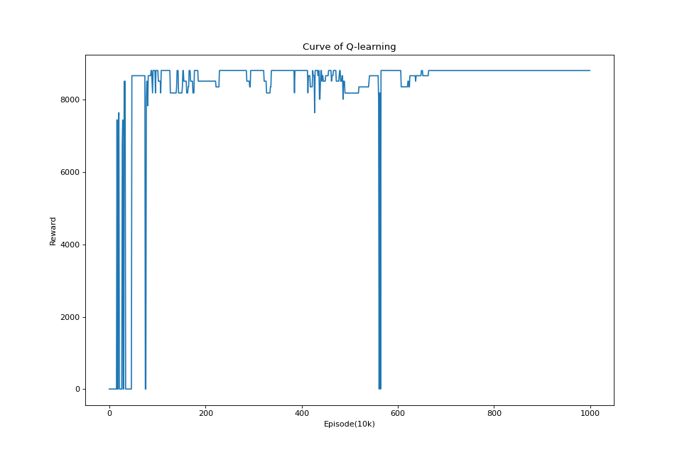

# 强化学习算法实践项目文档
<p align="right">信息科学技术学院&emsp;汤宸名</p>

## 一、简介
### 1.项目内容
本项目致力于使用强化学习的两种算法，即Q-learning和Policy-Gradient，来求解一个旅行商问题的具体实例。本项目所有代码均采用python编写，两种算法都是从底层开始构建，没有调用任何相关库的内容。
### 2.文件架构
本项目所有内容均存放在workspace目录下。
- code：存放源代码。
  - env_ql.py：Q-learning所用的环境代码。
  - env_pg.py：Policy-Gradient所用的环境代码。
  - q_learning.py：Q-learning的学习代码。
  - policy_gradient.py：Policy-Gradient的学习代码。
  - \_\_main\_\_.py：程序入口，为运行该项目程序，只需运行该python文件。
- result：存放项目运行的结果。
  - data：存放收敛时的Q值表与参数矩阵。
  - figure：存放两个算法的学习曲线。
  - path：存放两个算法得到的最终路径。
- README.md：本文档。

## 二、程序流程
### 1. Q-learning
在每一次迭代中，智能体采用epsilon-greedy的方式选择在当前状态下Q值最大的动作（$1-\epsilon$）或随机选择一个动作（$\epsilon$）。随后采用相应动作与环境交互，并得到环境返回的状态、回报（reward）以及是否终止的信息（done），并根据得到的回报值更新上一步的状态-动作对应的Q值。如此循环直到走到终态（即done非零），完成一个episode。程序经过多次episode的迭代直到Q值表收敛，得到最终结果。与*Q-learning*原文中的表示有所不同，本项目中一个episode指智能体从初始态走到终态的一个全过程，而更新Q值表的周期为智能体的每一步。

### 2. Policy-Gradient
Policy-Gradient以一个epoch为单位，每个epoch中运行batch_size次episode，随后再更新参数矩阵。若干次epoch后，参数矩阵收敛，得到最终结果。

其中，每个epoch都会维护一个delta_parameter的矩阵。对于每一个episode，智能体都会运行若干步直到达到终止状态。对于每一步，智能体都是对当前状态对应的四个参数做softmax运算后以四个结果的概率随机选取一个动作，并以相应动作与环境交互，得到环境返回的状态、回报（reward）以及是否终止的信息（done），最后通过得到的回报值更新delta_parameter矩阵，而不立即更新parameter即参数矩阵。当一个epoch中的所有episode都运行完毕，程序才会将积累的delta_parameter矩阵加到parameter矩阵上实现参数的更新。

为了尽量避免该算法出现收敛到局部最优从而找不到最优解的情况，我们采用了类似随机重启的思想，即多次进行Policy-Gradient的学习过程，并从中找出最优解作为最终结果。

## 三、实现细节及相关探索
### 1. Q-learning
#### 1.1 超参数
- episode：即迭代次数，设置为10000000。经过实验可以看到，程序迭代超过一千万次后基本可以实现Q值表的收敛。
- epsilon：即epsilon-greedy策略中智能体随机选择动作的概率$\epsilon$，设置为0.1。在实验过程中，当epsilon取值过小时，智能体更加容易陷入一些局部优解中，导致Q值表的收敛过于缓慢；较大的epsilon可以帮助智能体更多地“探索”，从而更容易找到全局最优。
- alpha：即学习率$\alpha$，设置为0.01。这是一个较为常用的取值。过大的alpha会导致Q值难以收敛，过小的alpha则容易使智能体陷入局部最优。
- gamma：即更新Q值表时考虑下一步效用时的折扣率$\gamma$，设置为0.9。当gamma越大，智能体就越看重长远利益；否则，智能体更重视眼前利益。

#### 1.2 Q值表的初始化
为了简便起见，所有的Q值都被初始化为-1。因为Q-learning最终总是收敛于全局最优，因此不需要考虑初始化带来的问题。

#### 1.3 回报值的设置
回报值由环境控制，可以分为以下几类：
- 成功抵达终态：返回$reward = 10000$，同时done置为1。
- 出界：返回$reward = -300$，同时done置为2。较大的惩罚防止智能体出界。
- 重复访问城市：返回$reward = -1000$，同时done置为3。较大的惩罚防止智能体重复访问同一个城市。
- 普通情况：返回$reward = -(1 + record[X][Y] + 2\times step)$，同时done置为0，其中record表示当前坐标已被访问的次数，step表示当前智能体已行走的步数，两个变量均由环境维护。这样设计的目的，一是为了防止智能体出现在两个点之间反复来回的情况，保证了在单个episode中智能体总能到达最终状态（当然，可能是非法终态），而不会一直陷于在两点之间反复来回的死循环；二是为了加强对多走步数的惩罚，让智能体更快学习到最短的路径。

#### 1.4 Q值的更新
根据Q-learning的理论，Q值的更新方式遵从以下公式：
$$Q_n(x_n,a) = (1-\alpha)Q_{n-1}(x_n,a)+\alpha (r_n+\gamma V_{n-1}(y_n))$$
其中$x_n$表示上一个状态，$a$表示上一个状态选择的动作，$y_n$表示在$x_n$选择$a$动作后到达的新的状态，$V_n$表示$y_n$状态下的四个$Q$值中最大的值。

在本项目代码中，Q值更新体现如下：
```python
Q[state_pos][action] = (1-alpha)*Q[state_pos][action] + alpha*(reward + gamma*V_next)
```
特殊地，当达到done值为2的终态，即出界时，$y_n$不存在，从而不存在V_next的值，因此Q值更新为：
```python
Q[state_pos][action] = (1-alpha)*Q[state_pos][action] + alpha*reward
```

### 2. Policy-Gradient
#### 2.1 超参数
- restart：随机重启的次数，设置为100。在实验中，算法重启100次后基本可以找到最优解。
- epoch：更新参数的次数，设置为20。实验表明，参数收敛速度极快，在十次更新后基本已经收敛。
- batch_size：每个epoch所完成的episode数，设置为300。实验表明，运行较多次的episode后再更新参数，可以得到更具有全局观的参数，降低了陷入局部最优的风险。
- alpha：学习步长$\alpha$，设置为0.001。
- gamma：计算每一步效用时考虑后续步效用的折扣率$\gamma$，设置为0.9。取值越大越看重长远利益。

#### 2.2 参数矩阵的初始化
由于Policy-Gradient易陷于局部最优的特性，我们对参数矩阵采用随机初始化，并且多次重启算法，提高找到全局最优的可能。

#### 2.3 回报值的设置
回报值由环境控制，可以分为以下几类：
- 成功抵达终态：返回$reward = 10000$，同时done置为1。
- 出界：返回$reward = -100$，同时done置为2。较大的惩罚防止智能体出界。
- 重复访问城市：返回$reward = -100$，同时done置为3。较大的惩罚防止智能体重复访问同一个城市。
- 多次访问某点：返回$reward = -2$，同时done置为4。由于Policy-Gradient算法不是即时更新参数，因此若陷入两点之间反复来回或一直走一条环路的死循环，则无法脱出，需要环境强行终止其活动，同时给予一定惩罚，防止智能体再次进入死循环。
- 首次访问城市：返回$reward = 200\times cnt^2$，同时done置为0，其中$cnt$表示已访问的城市数量。这是为了引导智能体访问城市，并且访问的城市越多奖励越大，从而让智能体更容易找到一条成功抵达终态的路径。
- 普通情况：返回$reward = -1$，同时done置为0。

#### 2.4 参数矩阵的更新
本算法通过softmax后依概率选取的方式得到动作，对于某一状态$s$下的每一个参数$x_i, i\in \{1,2,3,4\}$，其对应概率为
$$p_i = \frac {e^{x_i}} {e^{x_1}+e^{x_2}+e^{x_3}+e^{x_4}}$$
若选择了动作$i$，则其对于$x_i$的梯度为
$$\frac {\partial\rho logp_i}{\partial x_i} = \rho (1-\frac {e^{x_i}} {e^{x_1}+e^{x_2}+e^{x_3}+e^{x_4}})$$
对于$x_j,j\ne i$的梯度为
$$\frac {\partial\rho logp_i}{\partial x_j}  = \rho (-\frac {e^{x_j}} {e^{x_1}+e^{x_2}+e^{x_3}+e^{x_4}})$$
其中$\rho$为该动作的效用期望函数，取值为
$$\rho = \sum^{\infty}_{t = 0} {\gamma}^tr_t$$
其中$r_t$表示取动作$i$后第t步得到的回报，$\gamma$即折扣率gamma。
当一个epoch结束，参数更新为：
$$x_i = x_i + \alpha \sum \frac {\partial\rho logp_i}{\partial x_i}$$
即每次经过该状态得到的梯度都会被累积，并最终在epoch结束时用以更新参数。

## 四、结果
### 1. Q-learning
#### 1.1 学习曲线

可以看到，Q-learning在约一百万次迭代后进入了一段较为稳定的时期，似乎进入了收敛，但是仍有一定波动。到近六百万次迭代时出现了一个较大波动，随后很快被修正，并且逐步收敛，到七百万次迭代后收敛到全局最优。

#### 1.2 最终路径

图中深色格表示出发城市，浅色格表示其他城市，格中数字表示走到该格时的步数。该路径总共用34步成功完成，是一个最短路径。

### 2. Policy-Gradient
#### 1.1 学习曲线

可以看到，Policy-Gradient收敛极快，在约第五个epoch就已经收敛到最优。

#### 1.2 最终路径

该路径同样总共用34步成功完成，是一个最短路径。

## 五、算法分析
Q-learning算法保证了其最终能够收敛到全局最优的能力，代价是收敛速度较慢，需要多次迭代才能完成。

Policy-Gradient算法由于直接根据梯度更新参数，因此收敛速度快，但是容易陷入局部最优，无法保证找到全局最优解。本项目为了解决这一问题，采用了类似随机重启的方法，多次重启算法，对参数多次随机初始化，使得算法最终找到全局最优的概率大大提升。

## 六、总结
本项目分别使用Q-learning和Policy-Gradient算法来解决一个旅行商问题的具体实例，均得到了最优解。在实践过程中，我们验证了这两个算法各自的收敛特点，对算法有了更为深刻的理解。